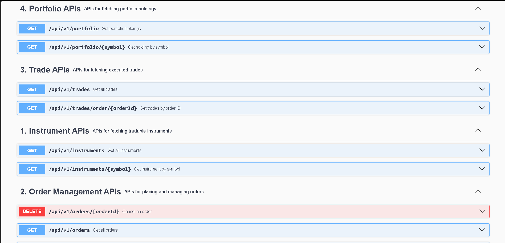

# Trading SDK - Bajaj Broking Campus Hiring Assignment

A Spring Boot-based Wrapper SDK for Trading APIs that provides endpoints for instruments lookup, order management, trade tracking, and portfolio management.

## 📋 Table of Contents
- [Prerequisites](#prerequisites)
- [Setup & Installation](#setup--installation)
- [Running the Application](#running-the-application)
- [Swagger UI Screenshots](#️-swagger-ui-screenshots)
- [API Documentation](#api-documentation)
- [Sample API Usage](#sample-api-usage)
- [Project Structure](#project-structure)
- [Assumptions](#assumptions)
- [Features](#features)

---

## 🔧 Prerequisites

Before running this application, ensure you have the following installed:

| Tool | Version | Download Link |
|------|---------|---------------|
| Java | 17+ | [Download JDK 17](https://adoptium.net/) |
| Maven | 3.6+ | [Download Maven](https://maven.apache.org/download.cgi) |

### Verify Installation
```bash
java -version   # Should show Java 17+
mvn -version    # Should show Maven 3.6+
```

---

## 🚀 Setup & Installation

### 1. Clone/Extract the Project
```bash
cd d:\Placement\Bajaj\trading-sdk
```

### 2. Build the Project
```bash
mvn clean install
```

### 3. Run Tests
```bash
mvn test
```

---

## ▶️ Running the Application

### Option 1: Using Maven
```bash
mvn spring-boot:run
```

### Option 2: Using JAR file
```bash
mvn clean package
java -jar target/trading-sdk-1.0.0.jar
```

The application will start on **http://localhost:8080**

### Access Points
| Service | URL |
|---------|-----|
| **API Base URL** | http://localhost:8080/api/v1 |
| **Swagger UI** | http://localhost:8080/swagger-ui.html |
| **OpenAPI Docs** | http://localhost:8080/api-docs |

---

## �️ Swagger UI Screenshots

### API Overview


### Available Endpoints


---

## �📖 API Documentation

### Base URL: `http://localhost:8080/api/v1`

### 1. 📊 Instrument APIs

| Method | Endpoint | Description |
|--------|----------|-------------|
| GET | `/instruments` | Get all available instruments |
| GET | `/instruments?exchange=NSE` | Filter by exchange |
| GET | `/instruments?symbol=RELIANCE` | Filter by symbol |
| GET | `/instruments?type=EQUITY` | Filter by instrument type |

**Response Model:**
```json
{
  "success": true,
  "data": [
    {
      "symbol": "RELIANCE",
      "exchange": "NSE",
      "instrumentType": "EQUITY",
      "lastTradedPrice": 2450.50
    }
  ],
  "message": "Instruments retrieved successfully"
}
```

---

### 2. 📝 Order Management APIs

| Method | Endpoint | Description |
|--------|----------|-------------|
| POST | `/orders` | Place a new order |
| GET | `/orders` | Get all orders for user |
| GET | `/orders/{orderId}` | Get specific order details |
| DELETE | `/orders/{orderId}` | Cancel an order |

**Order Request Model:**
```json
{
  "symbol": "RELIANCE",
  "exchange": "NSE",
  "orderType": "BUY",      // BUY or SELL
  "orderStyle": "MARKET",  // MARKET or LIMIT
  "quantity": 10,
  "price": 2450.00         // Required for LIMIT orders only
}
```

**Order Response Model:**
```json
{
  "success": true,
  "data": {
    "orderId": "ORD-1234567890",
    "symbol": "RELIANCE",
    "exchange": "NSE",
    "orderType": "BUY",
    "orderStyle": "MARKET",
    "quantity": 10,
    "price": 2450.50,
    "status": "EXECUTED",
    "placedAt": "2024-01-15T10:30:00",
    "executedAt": "2024-01-15T10:30:01"
  },
  "message": "Order placed successfully"
}
```

**Order Statuses:**
- `PLACED` - Order submitted (LIMIT orders)
- `EXECUTED` - Order completed (MARKET orders execute immediately)
- `CANCELLED` - Order cancelled by user

---

### 3. 📈 Trade APIs

| Method | Endpoint | Description |
|--------|----------|-------------|
| GET | `/trades` | Get all trades for user |
| GET | `/trades?orderId=ORD-123` | Filter by order ID |

**Trade Response Model:**
```json
{
  "success": true,
  "data": [
    {
      "tradeId": "TRD-1234567890",
      "orderId": "ORD-1234567890",
      "symbol": "RELIANCE",
      "exchange": "NSE",
      "quantity": 10,
      "executionPrice": 2450.50,
      "totalValue": 24505.00,
      "executedAt": "2024-01-15T10:30:01"
    }
  ],
  "message": "Trades retrieved successfully"
}
```

---

### 4. 💼 Portfolio APIs

| Method | Endpoint | Description |
|--------|----------|-------------|
| GET | `/portfolio` | Get portfolio holdings |
| GET | `/portfolio/summary` | Get portfolio summary |

**Portfolio Response Model:**
```json
{
  "success": true,
  "data": [
    {
      "symbol": "RELIANCE",
      "exchange": "NSE",
      "quantity": 50,
      "averagePrice": 2400.00,
      "currentPrice": 2450.50,
      "currentValue": 122525.00,
      "profitLoss": 2525.00,
      "profitLossPercentage": 2.10
    }
  ],
  "message": "Portfolio retrieved successfully"
}
```

---

## 🧪 Sample API Usage

### Using cURL Commands

#### 1. Get All Instruments
```bash
curl -X GET "http://localhost:8080/api/v1/instruments" -H "accept: application/json"
```

#### 2. Get NSE Instruments Only
```bash
curl -X GET "http://localhost:8080/api/v1/instruments?exchange=NSE" -H "accept: application/json"
```

#### 3. Place a BUY MARKET Order
```bash
curl -X POST "http://localhost:8080/api/v1/orders" \
  -H "Content-Type: application/json" \
  -d '{
    "symbol": "RELIANCE",
    "exchange": "NSE",
    "orderType": "BUY",
    "orderStyle": "MARKET",
    "quantity": 10
  }'
```

#### 4. Place a SELL LIMIT Order
```bash
curl -X POST "http://localhost:8080/api/v1/orders" \
  -H "Content-Type: application/json" \
  -d '{
    "symbol": "TCS",
    "exchange": "NSE",
    "orderType": "SELL",
    "orderStyle": "LIMIT",
    "quantity": 5,
    "price": 3600.00
  }'
```

#### 5. Get All Orders
```bash
curl -X GET "http://localhost:8080/api/v1/orders" -H "accept: application/json"
```

#### 6. Get Specific Order
```bash
curl -X GET "http://localhost:8080/api/v1/orders/{orderId}" -H "accept: application/json"
```

#### 7. Cancel an Order
```bash
curl -X DELETE "http://localhost:8080/api/v1/orders/{orderId}" -H "accept: application/json"
```

#### 8. Get All Trades
```bash
curl -X GET "http://localhost:8080/api/v1/trades" -H "accept: application/json"
```

#### 9. Get Portfolio Holdings
```bash
curl -X GET "http://localhost:8080/api/v1/portfolio" -H "accept: application/json"
```

#### 10. Get Portfolio Summary
```bash
curl -X GET "http://localhost:8080/api/v1/portfolio/summary" -H "accept: application/json"
```

### Using Swagger UI (Recommended for Testing)
1. Start the application
2. Open browser and go to: **http://localhost:8080/swagger-ui.html**
3. Explore and test all APIs interactively

---

## 📁 Project Structure

```
trading-sdk/
├── src/
│   ├── main/
│   │   ├── java/com/bajaj/tradingsdk/
│   │   │   ├── TradingSdkApplication.java      # Main entry point
│   │   │   ├── config/
│   │   │   │   └── DataInitializer.java        # Sample data loader
│   │   │   ├── controller/
│   │   │   │   ├── InstrumentController.java   # Instrument APIs
│   │   │   │   ├── OrderController.java        # Order APIs
│   │   │   │   ├── TradeController.java        # Trade APIs
│   │   │   │   └── PortfolioController.java    # Portfolio APIs
│   │   │   ├── dto/
│   │   │   │   ├── ApiResponse.java            # Generic response wrapper
│   │   │   │   ├── OrderRequest.java           # Order request DTO
│   │   │   │   └── OrderResponse.java          # Order response DTO
│   │   │   ├── exception/
│   │   │   │   ├── GlobalExceptionHandler.java # Centralized error handling
│   │   │   │   ├── ResourceNotFoundException.java
│   │   │   │   ├── ValidationException.java
│   │   │   │   ├── OrderException.java
│   │   │   │   └── InsufficientHoldingsException.java
│   │   │   ├── model/
│   │   │   │   ├── Instrument.java             # Instrument entity
│   │   │   │   ├── Order.java                  # Order entity
│   │   │   │   ├── Trade.java                  # Trade entity
│   │   │   │   ├── PortfolioHolding.java       # Portfolio entity
│   │   │   │   ├── OrderType.java              # BUY/SELL enum
│   │   │   │   ├── OrderStyle.java             # MARKET/LIMIT enum
│   │   │   │   ├── OrderStatus.java            # Order status enum
│   │   │   │   └── InstrumentType.java         # Instrument type enum
│   │   │   ├── repository/
│   │   │   │   ├── InstrumentRepository.java   # In-memory instrument store
│   │   │   │   ├── OrderRepository.java        # In-memory order store
│   │   │   │   ├── TradeRepository.java        # In-memory trade store
│   │   │   │   └── PortfolioRepository.java    # In-memory portfolio store
│   │   │   └── service/
│   │   │       ├── InstrumentService.java      # Instrument business logic
│   │   │       ├── OrderService.java           # Order business logic
│   │   │       ├── TradeService.java           # Trade business logic
│   │   │       └── PortfolioService.java       # Portfolio business logic
│   │   └── resources/
│   │       └── application.properties          # App configuration
│   └── test/
│       └── java/com/bajaj/tradingsdk/
│           └── TradingSdkApplicationTests.java # Unit tests
├── pom.xml                                     # Maven dependencies
└── README.md                                   # This file
```

---

## 📝 Assumptions

1. **Single User Context**: The SDK operates for a single mocked user (`USER001`) as authentication is simulated.

2. **In-Memory Storage**: All data is stored in-memory using `ConcurrentHashMap` for thread safety. Data resets on application restart.

3. **Market Order Execution**: MARKET orders are executed immediately at the last traded price of the instrument. LIMIT orders remain in PLACED status.

4. **Sample Data**: The application loads 15 sample instruments (NSE, BSE stocks, and ETFs) and 4 initial portfolio holdings on startup.

5. **SELL Order Validation**: When placing a SELL order, the system validates that the user has sufficient holdings. Insufficient holdings will result in an error.

6. **Order Cancellation**: Only orders with status `PLACED` can be cancelled. `EXECUTED` orders cannot be cancelled.

7. **Price Requirement**: For LIMIT orders, the price field is mandatory. For MARKET orders, the price is automatically set to the last traded price.

8. **Exchange Validation**: Orders can only be placed for valid instruments that exist in the instrument repository.

9. **Thread Safety**: All repositories use `ConcurrentHashMap` to ensure thread-safe operations.

10. **REST API Design**: The API follows RESTful conventions with proper HTTP status codes and JSON responses.

---

## ✨ Features

### Core Features
- ✅ **Instrument Lookup** - View all trading instruments with filtering
- ✅ **Order Placement** - Place BUY/SELL orders (MARKET/LIMIT)
- ✅ **Order Management** - View, track, and cancel orders
- ✅ **Trade History** - View executed trades
- ✅ **Portfolio Tracking** - View holdings with P&L calculation

### Bonus Features
- ✅ **Swagger/OpenAPI** - Interactive API documentation
- ✅ **Validation** - Request validation with meaningful error messages
- ✅ **Exception Handling** - Centralized error handling
- ✅ **Unit Tests** - Comprehensive test coverage
- ✅ **Order Execution Simulation** - MARKET orders execute immediately
- ✅ **Portfolio P&L** - Real-time profit/loss calculation

---

## 🛠️ Technologies Used

| Technology | Version | Purpose |
|------------|---------|---------|
| Java | 17 | Programming Language |
| Spring Boot | 3.2.0 | Application Framework |
| Maven | 3.6+ | Build Tool |
| Lombok | Latest | Reduce Boilerplate |
| Springdoc OpenAPI | 2.3.0 | Swagger Documentation |
| JUnit 5 | Latest | Unit Testing |

---

## 👤 Author

**Submitted for**: Bajaj Broking Campus Hiring Assignment

---

## 📞 Support

For any queries or issues, please refer to:
- Swagger UI: http://localhost:8080/swagger-ui.html
- API Docs: http://localhost:8080/api-docs

---

*Thank you for reviewing this assignment!* 🙏
